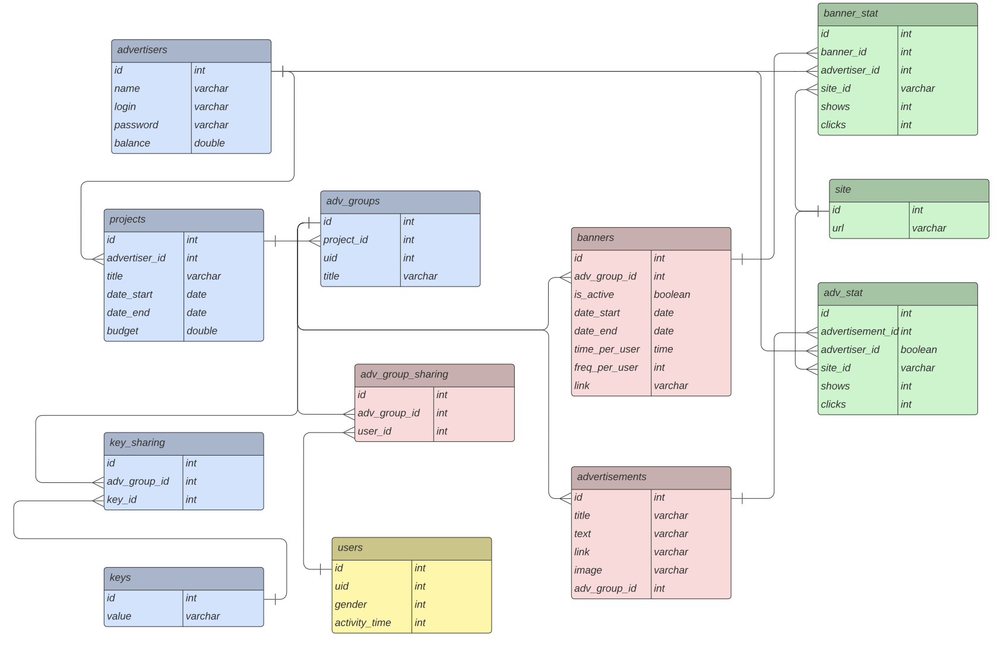
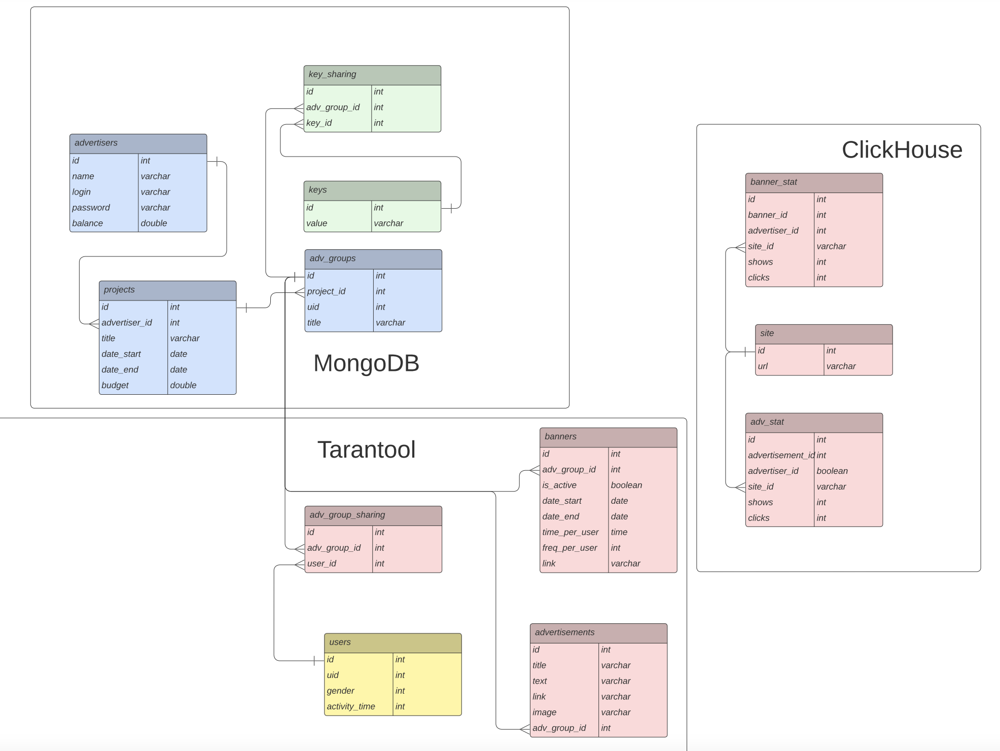
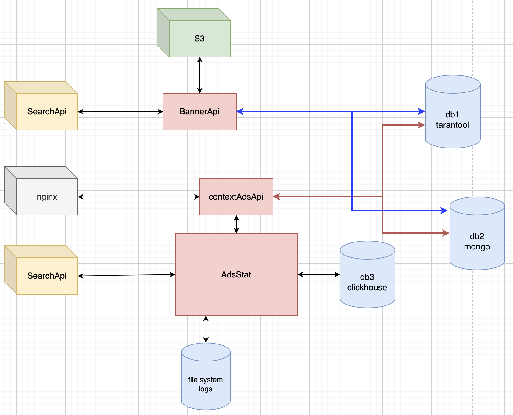

# 1. Тема и целевая аудитория  
Сервис контекстной рекламы
## MVP  
1) Регистрация аккаунта
2) Создание рекламной компании
3) Создание группы объявлений
4) Создание объявлений / баннеров
5) Показ рекламы пользователям рекламной сети
6) Сбор и обновление статистики показа рекламы

## Целевая аудитория  
Целевой аудиторией являются рекламодатели, использующие услуги сервиса для размещения рекламы,  
а также пользователи рекламной сети, использующие поиск, и аудитория сайтов-партнеров рекламной сети.

# 2. Расчет нагрузки  
## Продуктовые метрики  
* **Месячная аудитория**  
Месячная аудитория РСЯ - 95.4% всех пользователей интернета в России(124 млн[1])[2]
Итого: `124 млн * 0.954 = 118.3 млн` пользователей

* **Дневная аудитория**  
`65 млн`[3]

* **Средний размер хранилища пользователя**  
    * ***Профиль пользователя***    
    Метаинформация профиля = `4б * 3 * 100 = 1кБ`

    * ***Рекламные кампании пользователя***  
    Максимум 10 кампаний на пользователя
    Метаинформация кампаний = `4б * 100 = 400б`
    Итого: `400б * 10 = 4кБ`

    * ***Группы объявлений***  
    Максимум 50 групп объявлений[4][5]
    Метаинформация групп объявлений = `4б * 100 = 400б`
    Итого: `400б * 50 = 20кБ`

    * ***Ключевые фразы***  
    Максимум 200 ключевых фраз на группу[6]
    Максимум 4096 символов в ключевой фразе[6]
    Метаинформация ключевых фраз = `10 * 50 * 200 * 4096 * 4б = 1.6Гб`

    * ***Объявления***  
    У компаний со стажем в среднем 300 объявлений[5]
    У Яндекс.Директ количество групп объявлений 1000, количество объявлений на группу 50[4]
    Пусть максимум 50 объявлений на группу объявлений
    Метаинформация объявлений = `50 * 50 * 4 * 4б = 4000000б = 4мБ`
    Картинки объявлений = `50 * 50 * 10мБ = 25Гб`[7]

    * ***Баннеры***  
    Пусть максимум 50 баннеров на группу объявлений
    Максимальный размер баннера 150кБ[8]
    Размер хранилища баннеров = `50 * 50 * 150кБ = 375 мБ`

* **Среднее количество действий пользователя по типам в день**  

|**Группа пользователей**|**Тип действия**               |**Частота**|
|------------------------|-------------------------------|----------|
|рекламодатели           |просмотр аккаунта              |8 / день  |
|рекламодатели           |создание объявления            |3 / месяц |
|аудитория рекламной сети|поисковый запрос               |7 / день[9]|
|аудитория рекламной сети|переход на посадочную страницу |2 / день  |

## Технические метрики
* **Размер хранения в разбивке по типам данных**
    * ***Профили пользователей(аудитория рекламной сети)***  
    Пусть 20б на профиль(метаинформация)
    Итого: `20б * 118.3млн = 2.4Гб`
    * ***Баннеры рекламодателей***  
    `200000 * 375мБ = 75Тб`
    * ***Объявления рекламодателей***  
    `200000 * (4мБ + 25Гб) = 800Гб(метаинформация) + 5000Тб(картинки)`
    * ***Ключевые фразы***  
    `200000 * 1.6Гб = 320Тб`

* **Сетевой трафик** 
* ***Пиковое потребление в течении суток (в Гбит/с)***  
Пиковое число запросов с 15.30-16.30 7% всех запросов в день[10]
Можно считать что на это время приходиться и 7% всех показов рекламы (4млрд/сутки)[ссылка]
Итого: `4млрд * 0.07 = 280000000(` (показов рекламы)
Пиковый трафик: `(280M * 10Мб)/ 3600с = 6222 Гбит/с`\

* ***Суммарное потребление в течении суток (в Гбайт/сутки)***  
Суммарный трафик: `4 млрд * 10Мб = 40M Гб/сутки`

* **RPS в разбивке по типам запросов (запросов в секунду)**  

Пусть рекламодатель совершает 10 запросов в пределах сессии при просмотре аккаунта
Итого: `(200000 * 8 * 10) / (24 * 3600) = 185RPS`

Аудитория рекламной сети получает 4 млрд рекламы / сутки
Итого: `4млрд / (24 * 3600) = 46296.3 RPS`

## 3. Логическая схема

### Пояснение к логической схеме
advertisers - данные рекламодателей  
projects - рекламные кампании рекламодателей  
adv_groups - рекламные группы  
keys - ключевые фразы  
users - пользователи рекламной сети  
banner - баннеры  
advertisements - рекламные объявления  
adv_stat - статистика по рекламные объявлениям  
banner_stat - статистика по баннерам   

## 4.  Физическая схема

### Пояснение к физической схеме
Для хранения данных о пользователях рекламной сети(users), рекламных объявлениях, баннерах
используется СУБД Tarantool. Tarantool хранит все данные в оперативной памяти и способен отдавать информацию быстрее реляционных СУБД. Также Tarantool имеет возможность шардирования и репликации. Шардирование users  
по uid(хеш-функция от ip+браузер). Можно завести 120 виртуальных шардов, маппить на них реальные сервера. При распределении на конкретный шард берется остаток от деления uid на число виртуальных шардов.

Для хранения данных пользователей сервиса(advertisers), в том числе данных о балансе пользователей, а также ключевых фраз используется СУБД MongoDB, так как она хранит данные на диске(они не пропадут при отключении источника питания) и хорошо масштабируется(для хранения ключевых фраз). Также MongoDB активно обновляется и является наиболее популярной noSQL СУБД у разработчиков, поэтому в ее поддержке не возникнет проблем. Шардирование ключевых фраз производится тоже по принципу виртуальных шардов. Пусть будет 2000 виртуальных шардов(в каждом помещается до 1 млн ключевых фраз). Хеш функция применяeтся к ключевым фразам.

Для хранения статистики выбрана колоночная СУБД ClickHouse. Она хорошо подходит для аналитических запросов на огромных данных. Также данные в ClickHouse можно записывать батчами, что ускорит процесс записи в базу. Так как статистика не должна обязательно обновляться сразу, то для отказоустойчивости подойдет асинхронная репликация.

Индексы:  

Mongo:  
advertisers - индекс по login  
adv_groups - индексы по project_id, uid  
projects - индексы по advertiser_id, date_start, date_end  
keys - индекс по ключевой фразе  

Tarantool:   
users - индекс по uid пользователей  
banners - индексы по adv_group_id  
advertisements - adv_group_id

Clickhouse:  
adv_stat - индекс по advertisement_id  
banner_stat - индекс по banner_id  

## 5. Технологии

|**Технология**          |**Область применения**         |**Мотивационная часть**|
|------------------------|-------------------------------|-----------------------|
|Go                      |Сервис contextAdsApi           |Поддержка конкурентности, большая скорость разработки, легко поддерживать код|
|Си++                    |Сервис   BannerApi             |Производительность, популярность на рынке специалистов|
|Mongo                   |DB1(хранение данных рекламодателей, ключевых фраз)|Надежность, шардирование, популярность среди специалистов|
|Tarantool               |DB2(хранение данных пользователей рекламной сети, объявлений) |Производительность, удобное шардирование|
|Clickhouse              |DB3(хранение статистики) |Скорость выборки аналитических запросовна большиз данных, шардирование|
|S3                      |Хранилище изображений и баннеров   |Удобство эксплуатации|

## 6. Схема проекта

Проект имеет микросервисную архитектуру. Состоит из трех микросервисов.  
Основной сервис contextAdsApi отвечает на все запросы пользователей(рекламодателей).  
Запросы проксируются и балансируются через nginx.

Сервис BannerApi используется для отдачи объявлений и баннеров поисковой системе.  
Пример: пользователь вбил в поисковик *key*. Запрос уходит в поисковый сервис, а оттуда  
по grpc в сервис BannerApi. BannerApi получает из DB2(Mongo) uid групп объявлений,  
для которых ключевая фраза совпала с *key*. Затем BannerApi по полученным uid загружает   
необходимые файлы(картинки, баннеры) из облака S3. Метаинформацию для объявлений BannerApi  
получает из DB1(Tarantool). Готовые объявления и баннеры отдает обратно  
сервису поиска.

Сервис AdsStat служит для учета статистики. Запрос на получение статистики по рекламе от  
рекламодателя поступает в сервис contextAdsApi, который перенаправляет запрос в AdsStat.
Данные по статистике хранятся в DB3(Clickhouse), с которой взаимодействует только  
сервис AdsStat. Для обновления статистики кликов и показов рекламы, поисковый сервис отправляет  
запрос в AdsStat. Статистика в DB3 обновляется через очередь: AdsStat пишет логи с обновлением в  
файловой системе, и cron демон раз в секунду разгребает очередь и записывает данные пачкой в Clickhouse.

## Список использованных источников
1. https://iabrus.ru/news/564
2. https://www.fontanka.ru/2021/10/19/70202651/
3. https://adbutton.net/ru/articles/advertising-networks/yandeks-reklamnaya-set-princip-raboty-i-otlichiya-ot-yandex-direct
4. https://yandex.ru/support/direct/troubleshooting/interface.html)(https://www.vladimirkulik.com/%D1%8F%D0%BD%D0%B4%D0%B5%D0%BA%D1%81-%D0%B4%D0%B8%D1%80%D0%B5%D0%BA%D1%82-%D0%B3%D1%80%D1%83%D0%BF%D0%BF%D1%8B-%D0%BE%D0%B1%D1%8A%D1%8F%D0%B2%D0%BB%D0%B5%D0%BD%D0%B8%D0%B9/
5. https://yandex.ru/company/researches/2010/ya_context_10/
6. https://yandex.ru/support/direct/keywords/keywords.html
7. https://yandex.ru/support/direct/efficiency/images.html
8. https://yandex.ru/legal/banner_adv_rules/
9. https://yandex.ru/company/researches/2010/ya_regions_search_2010#toc1
10. https://yandex.ru/company/researches/2014/ya_search_2014

    

    

